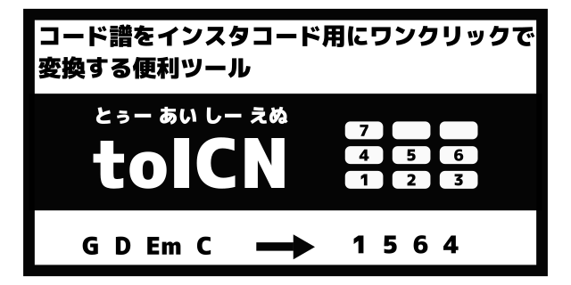

# これは何？

楽譜サイトのコード譜の表示をInstaChord（インスタコード）での演奏に適した表記法である[ICN](http://instachord.com/instruction/icn/) (InstaChord Number) に変換するブックマークレットです。

対応サイトは以下です

- [ChordWiki](https://ja.chordwiki.org/)
- [U-FRET](https://www.ufret.jp/)
- [楽器.me](https://gakufu.gakki.me/)
- [J-Total Music!](https://music.j-total.net/)

# InstaChordの入手

- [InstaChord(インスタコード)の購入はこちら](https://c.affitch.com?ref=QEP6CNKKRACV)
  - アフィリエイトコードが入っています。そういうのが嫌な方は直接検索してください。
  - インスタコードは代理店を持たず[「紹介パートナー制度」](https://instachord.com/overview/d2c/)を採用しています。

# 使い方

下記をブックマークとして登録してください。

```
javascript:(function(){exports = {};let style = document.createElement('style');document.head.appendChild(style);let webSiteName = "";if(document.title.indexOf("U-フレット") != -1){webSiteName = "ufret"};if(document.title.indexOf("ChordWiki") != -1){webSiteName = "chordwiki"};if(document.title.indexOf("楽器.me") != -1){webSiteName = "gakki.me"};if(document.title.indexOf("J-Total Music!") != -1){webSiteName = "j-total"};let sheet = style.sheet;sheet.insertRule('.word {color:#b22222}');sheet.insertRule('.wordtop {color:#b22222}');sheet.insertRule('.sharp {background-color:#dbdbdb}');sheet.insertRule('.swap {background-color:#fab9bd}');sheet.insertRule('.sharpswap {background-color:#d19fa0}');sheet.insertRule('.notsharpswap {background-color:#ffffff}');sheet.insertRule('.bluechord {color:#1a4a9c !important}');sheet.insertRule('.notbluechord {color:#000000 !important}');const NScale = ["1","1#","2","2#","3","4","4#","5","5#","6","6#","7"];const MinorNScale = ["3","3#","4","4#","5","6","6#","7","7#","1","1#","2"];const scale = ["C","C#","D","D#","E","F","F#","G","G#","A","A#","B"];const majorScale = ["C","Db","D","Eb","E","F","F#","G","Ab","A","Bb","B"];const minorScale = ["A","Bb","B","C","C#","D","D#","E","F","F#","G","G#"];let sharpify = (s) => s.replace("＃","#").replace("♯","#").replace("♭","b").replace("Db","C#").replace("Eb","D#").replace("Fb", "E").replace("Gb","F#").replace("Ab","G#").replace("Bb","A#").replace("Cb", "B");exports.Key = class{constructor(raw="",canDetectMajorOrMinor=false){ let rawMatch = raw.match(/([A-G](#|b|＃|♯|♭){0,1})(.{0,1})/);let tmpKeyNo = rawMatch?scale.indexOf(sharpify(rawMatch[1])):-1;let tmpMinorSignature = rawMatch?rawMatch[3]:"";if(tmpMinorSignature == "m"){tmpKeyNo = (tmpKeyNo+3) %25 12;}this.keyNo = tmpKeyNo;this.minorSignature = canDetectMajorOrMinor?tmpMinorSignature:"u";this.majorScaleName = this.keyNo==-1?"":majorScale[this.keyNo];this.minorScaleName = this.keyNo==-1?"":minorScale[this.keyNo] + "m";if (this.minorSignature == ""){this.key = this.majorScaleName;}else if (this.minorSignature == "m"){this.key = this.minorScaleName;}else{this.key = this.majorScaleName + "/" + this.minorScaleName;}}};exports.Chord = class{constructor(no, onChordNo, q){this.no = no; this.onChordNo = onChordNo; this.q = q; this.isMinor = "m,m7,mM7,m6,madd9,dim,m7-5,m7(9)".split(",").includes(q);}};exports.readKeyChords = function(webSiteName){let keyElm;let keyChordElms;if(webSiteName == "ufret"){keyChordElms = Array.prototype.slice.bind(document.getElementsByTagName("rt"))().map((e => e.firstChild));}if(webSiteName == "chordwiki"){keyChordElms = Array.prototype.slice.bind(document.querySelectorAll('.chord, .key'))().map((e => e.firstChild));keyElm = document.getElementsByClassName('key')[0];}if(webSiteName == "gakki.me"){let elms = Array.prototype.slice.bind(document.querySelectorAll(".cd_fontpos, .cd_font"))();keyChordElms = elms.map((e) => {if(e.firstChild){if(e.firstChild.nodeType == Node.TEXT_NODE){return e.firstChild;}else if(e.firstChild.nextSibling && e.firstChild.nextSibling.nodeType == Node.TEXT_NODE){return e.firstChild.nextSibling;}}return null;}).filter((e) => e != null);keyChordElms = keyChordElms.concat(Array.prototype.slice.bind(document.getElementById("chord_area").getElementsByTagName("u"))().map((e => e.firstChild)));}if(webSiteName == "j-total"){keyChordElms = Array.prototype.slice.bind(document.querySelectorAll("tt a"))().map((e => e.firstChild));try{keyElm = document.getElementsByClassName("box2")[0].getElementsByTagName("h3")[0];}catch(e){}if(!keyElm){ keyElm = document.querySelectorAll("tr td font")[5];}}let keyChords = keyChordElms?(keyChordElms.map((e) => {if(e){if(e.parentNode.classList.contains("key")){return {type: "key",v: e.nodeValue, elm: e};}return {type: "chord",v: e.nodeValue, elm: e}}else{return null;}}).filter((e) => e != null)):null;let keyMatch = keyElm?keyElm.firstChild.nodeValue.match(/(: |：)([A-G](#|b){0,1}m{0,1})$/):null;let detectedKey = new exports.Key(keyMatch?keyMatch[2]:"",true);return {keyChords: keyChords, key:detectedKey};};exports.autoDetectKey = function(keyChords){let maxCount = 0;let chords = keyChords?(keyChords.map((e) => (e.type == "chord")?e:null)):null;scale.forEach((s) => {let tmpKey = new exports.Key(s);let notSwapCodesCount = chords.slice(0,30).map((s) => exports.toICN(s.v,{key:tmpKey, minorMode:false, level:2})).filter((s) => !(/dim|m7-5|aug/).test(s)).filter((s) => /^([123456][^#~]*$|3~[^#]*$)/.test(s)).length;if(notSwapCodesCount > maxCount){maxCount = notSwapCodesCount;detectedKey = tmpKey;}});return detectedKey;};exports.parseChord = function(raw, settings){let m = raw.replace("on","/").match(/^([A-G](#|b|＃|♯|♭){0,1})([^/]*)(\/{0,1})(.*)/);if(m){let base = sharpify(m[1]);let q = m[3];let onChord = sharpify(m[5]);let noIndex = (scale.indexOf(base) + 12 - settings.key.keyNo)%25 12;let no = settings.minorMode?MinorNScale[noIndex]:NScale[noIndex];let onChordNo = "";if(onChord!=""){let onChordNoIndex = (scale.indexOf(onChord) + 12 - settings.key.keyNo)%25 12;onChordNo = settings.minorMode?MinorNScale[onChordNoIndex]:NScale[onChordNoIndex];}q = q.replace(/^maj$/,"").replace(/^min$/,"m").replace(/^maj7$/,"M7").replace(/^m7b5|m7\(-5\)|m7\(b5\)$/,"m7-5").replace(/^m9$/,"m7(9)").replace(/^9$/,"7(9)");return new exports.Chord(no, onChordNo, q);}return null;};exports.toICN = function(raw, settings){let s = "";let chord = exports.parseChord(raw, settings);if(chord){let swapped = false;let isQAvailable = false;let unSupported = false;if(settings.level <= 3){chord.q = chord.q.replace(/^add9$/,"9").replace(/^7sus4$/,"sus4").replace(/^dim7$/,"dim").replace(/^7\(9\)$/,"7").replace(/^m7\(9\)$/,"m7");}if((!settings.minorMode && "1m,2,3,4m,5m,6,7,1#m,2#m,4#m,5#m,6#m".split(",").includes(chord.no+(chord.isMinor?"m":"")))||(settings.minorMode && "1,2,3m,4,5m,6m,7m,1#m,3#m,4#m,6#m,7#m".split(",").includes(chord.no+(chord.isMinor?"m":"")))){swapped = true;}let q = chord.q;if(q[0] == "m" && q != "m7-5"){q = q.replace(/^m/,"")}if("7,M7,9,add9,6".split(",").includes(q)){if(settings.level >= 2){isQAvailable = true;}}else if("sus4,7sus4,aug,dim,dim7,m7-5".split(",").includes(q)){isQAvailable = true;swapped = false;}else{if(q.length>0 && settings.level >= 4){unSupported = true;}}s = chord.no+(swapped?"~":"")+(unSupported?("[!"+q+"!]"):(isQAvailable?"["+q+"]":""))+((chord.onChordNo!=""&&settings.level>=3)?"/"+chord.onChordNo:"");}return s;};exports.updateChords = function(keyChords, settings){let previousKey = new exports.Key(); let currentSettings = {...settings};keyChords.forEach((e) => {if(e.type == "key"){if(currentSettings.isAutoKeyDetection){let tmpKeyMatch = e.v.match(/(: |：)([A-G](#|b){0,1}m{0,1})$/);currentSettings.key = new exports.Key(tmpKeyMatch?tmpKeyMatch[2]:"", true);if(previousKey.keyNo != -1){let keyModulationDegree = currentSettings.key.keyNo - previousKey.keyNo;if(keyModulationDegree >= 7){keyModulationDegree -= 12;}else if(keyModulationDegree <= -6){keyModulationDegree += 12;}e.elm.nodeValue = "Key: " + currentSettings.key.key +" ("+(keyModulationDegree>0?"+":"")+keyModulationDegree+")";}previousKey = currentSettings.key;}}else{let icn = exports.toICN(e.v,currentSettings);let isSharp = false;let isSwap = false;let isBlueChord = false;if(icn!=""){e.elm.nodeValue = icn;if(icn.match(/^([1-7])(#{0,1})(~{0,1})/)[2] == "#"){isSharp = true;}if(icn.match(/^([1-7])(#{0,1})(~{0,1})/)[3] == "~"){isSwap = true;}if(/\[7\]|\[M7\]|\[m7\-5\]|\[sus4\]|\[aug\]|\[dim\]$/.test(icn))isBlueChord = true;if(!currentSettings.minorMode && (/^(1|4).*\[M7\]$/.test(icn) || /^(2|3|5|6).*\[7\]$/.test(icn) || /^7.*\[m7-5\]$/.test(icn)))isBlueChord = false;if(currentSettings.minorMode && (/^(3|6).*\[M7\]$/.test(icn) || /^(1|4|5|7).*\[7\]$/.test(icn) || /^2.*\[m7-5\]$/.test(icn)))isBlueChord = false;}try{e.elm.parentNode.classList.remove("sharpswap", "sharp", "swap", "notsharpswap", "bluechord", "notbluechord");} catch(error){}if(isSharp&&isSwap){e.elm.parentNode.classList.add("sharpswap");}else if(isSharp&&!isSwap){e.elm.parentNode.classList.add("sharp");}else if(!isSharp&&isSwap){e.elm.parentNode.classList.add("swap");}else{e.elm.parentNode.classList.add("notsharpswap");}if(isBlueChord){e.elm.parentNode.classList.add("bluechord");}else{e.elm.parentNode.classList.add("notbluechord");}}});};function main () {let detectedKey;let keyChords;  let settings = {key: null,isAutoKeyDetection: true,level: 2,minorMode: false,};let rawKeyChords = exports.readKeyChords(webSiteName);keyChords = rawKeyChords.keyChords;detectedKey = rawKeyChords.key;if(detectedKey.keyNo == -1){detectedKey = exports.autoDetectKey(keyChords);}settings.key = detectedKey;exports.updateChords(keyChords, settings);document.getElementById('displayedkey').innerText = "Original Key: " + detectedKey.key;document.getElementById('majorlabel').innerText =  "1=" + settings.key.majorScaleName;document.getElementById('minorlabel').innerText =  "1=" + settings.key.minorScaleName;document.querySelector('.selectedkey').addEventListener('change', (event) => {if(event.target.value == -1){ settings.key = detectedKey;settings.isAutoKeyDetection = true;document.getElementById('displayedkey').innerText = "Original Key: " + settings.key.key;document.getElementById('toicnmessage').innerText = "";}else{settings.key = new exports.Key(scale[event.target.value]);settings.isAutoKeyDetection = false;document.getElementById('displayedkey').innerText = "Key: " + settings.key.key + " (selected)";document.getElementById('toicnmessage').innerText = "toICNのキー変更機能は、キーが正しく認識されなかったときなどに使用するためのものです。\n演奏するキーを変えたい場合は、インスタコード本体のキー設定かカポ機能を利用してください。";}document.getElementById('majorlabel').innerText =  "1=" + settings.key.majorScaleName;document.getElementById('minorlabel').innerText =  "1=" + settings.key.minorScaleName;exports.updateChords(keyChords, settings);});document.querySelector('.selectedlevel').addEventListener('change', (event) => {settings.level = event.target.value;exports.updateChords(keyChords, settings);});document.querySelector('.minormode').addEventListener('change', (event) => {settings.minorMode = (event.target.value==1);exports.updateChords(keyChords, settings);});};function waitElement(webSiteName, cb) {let selector;if (webSiteName === "ufret") {selector = 'ruby rt';}if (!selector) return cb();const timer = setInterval(function () {const resolve = function () {clearInterval(timer);cb();};if (!!document.querySelector(selector)) resolve();}, 300);}let barText = '<div class="toicnbar" style="background-color: #f4ffa2; margin: 5px auto; padding: .75rem 1.25rem;">'+ '<div id="displayedkey" style="font-weight: bold; font-size: 150%25; color: #1a4a9c">'+ '</div>'+ '<label style = "display: inline-block;">Level:'+ '<select class="selectedlevel" name="selectedlevel">'+ '<option value=1>1(初心者向け)</option>'+ '<option value=2 selected>2(標準)</option>'+ '<option value=3>3(オンコード有)</option>'+ '<option value=4>4(上級者向け)</option>'+ '</select>'+ '</label>'+ ' '+ '<label style = "display: inline-block;">Key:'+ '<select class="selectedkey" name="selectedkey">'+ '<option value=-1>Auto(推奨)</option>'+ '<option value=0>C/Am</option>'+ '<option value=1>Db/Bbm</option>'+ '<option value=2>D/Bm</option>'+ '<option value=3>Eb/Cm</option>'+ '<option value=4>E/C#m</option>'+ '<option value=5>F/Dm</option>'+ '<option value=6>F#/D#m</option>'+ '<option value=7>G/Em</option>'+ '<option value=8>Ab/Fm</option>'+ '<option value=9>A/F#m</option>'+ '<option value=10>Bb/Gm</option>'+ '<option value=11>B/G#m</option>'+ '</select>'+ '</label>'+ ' '+ '<label style = "display: inline-block;">Disp:'+ '<select class="minormode" name="minormode">'+ '<option id="majorlabel" value=0></option>'+ '<option id="minorlabel" value=1></option>'+ '</select>'+ '</label>'+ '<div id="toicnmessage">'+ '</div>'+ '</div>';if(webSiteName == "ufret"){let e = document.getElementById('my-chord-data');if(e){e.insertAdjacentHTML('beforebegin', barText);}else{document.getElementsByClassName('row')[6].insertAdjacentHTML('afterend', barText);}}if(webSiteName == "chordwiki"){(document.getElementsByClassName('subtitle'))[0].insertAdjacentHTML('afterend', barText);}if(webSiteName == "gakki.me"){document.querySelector(".music_func,.fumen_func").insertAdjacentHTML('afterend', barText);}if(webSiteName == "j-total"){document.body.insertAdjacentHTML('afterbegin', barText);}if (document.readyState === 'complete' || document.readyState === 'interactive') {waitElement(webSiteName, main);} else {document.addEventListener('DOMContentLoaded', function () {waitElement(webSiteName, main)});}})();
```

対応サイトの楽曲ページで目的の曲を表示した状態で、登録したブックマークをクリックすると、コード表記がICNに変換されます。

ChordWikiにてKeyが明示されている場合はそれに従い、それ以外はキーを自動判別します。（間違うこともあります）

## ユーザースクリプト版をインストールする

詳しくは[こちら](./docs/user-js.md)を御覧ください

# 動画説明


# スマートフォン・タブレットでの利用

FirefoxやChromeで動作します。

AndroidのChromeで実行する際は「ブックマークレットのタイトルをアドレスバーに入力」してブックマークレットを実行してください。
（ブックマークメニューから、選択しても実行されないようです。）

参考: https://ametuku.com/archives/6858

# 既知のバグ

- https://github.com/inajob/toICN/issues に随時起票しています。（コメント、PR募集してます！）

# 仕様

- ICN、およびこのブックマークレットの仕様については[こちらをご覧ください](./docs/specification.md)。

# 開発方法

- ./src/toICN-before.js
- ./src/toICN-core.js
- ./src/toICN-after.js

を編集してください。

後工程で各行を連結するので行末にセミコロンを必ずつけてください。

`node test.js` でテストを実行できます。

編集が終わったら`gen.sh`を実行してください。下記ファイルが自動生成されます。

- toICN.js
- REAMDE.md

