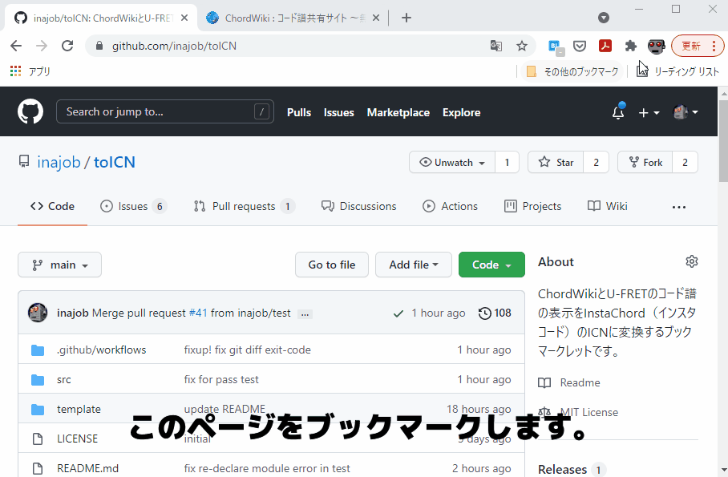

# これは何？

楽譜サイトのコード譜の表示をInstaChord（インスタコード）での演奏に適した表記法である[ICN](http://instachord.com/instruction/icn/) (InstaChord Number) に変換するブックマークレットです。

対応サイトは以下です

- [ChordWiki](https://ja.chordwiki.org/)
- [U-FRET](https://www.ufret.jp/)
- [楽器.me](https://gakufu.gakki.me/)
- [J-Total Music!](https://music.j-total.net/)

# InstaChordの入手

- [InstaChord(インスタコード)の購入はこちら](https://c.affitch.com?ref=QEP6CNKKRACV)
  - アフィリエイトコードが入っています。そういうのが嫌な方は直接検索してください。
  - インスタコードは代理店を持たず[「紹介パートナー制度」](https://instachord.com/overview/d2c/)を採用しています。

# 使い方

下記をブックマークとして登録してください。

```
javascript:(function(){exports = {};let style = document.createElement('style');document.head.appendChild(style);let sheet = style.sheet;sheet.insertRule('.word {color:#b22222}');sheet.insertRule('.wordtop {color:#b22222}');sheet.insertRule('.sharp {background-color:#dbdbdb}');sheet.insertRule('.swap {background-color:#fab9bd}');sheet.insertRule('.sharpswap {background-color:#d19fa0}');sheet.insertRule('.notsharpswap {background-color:#ffffff}');sheet.insertRule('.bluechord {color:#1a4a9c !important}');sheet.insertRule('.notbluechord {color:#000000 !important}');const scale = ["C","C#","D","D#","E","F","F#","G","G#","A","A#","B"];const majorScale = ["C","Db","D","Eb","E","F","F#","G","Ab","A","Bb","B"];const minorScale = ["A","Bb","B","C","C#","D","D#","E","F","F#","G","G#"];let sharpify = (s) => s.replace("＃","#").replace("♯","#").replace("♭","b").replace("Db","C#").replace("Eb","D#").replace("Fb", "E").replace("Gb","F#").replace("Ab","G#").replace("Bb","A#").replace("Cb", "B");exports.Key = class{constructor(raw=""){let rawMatch = raw.match(/([A-G](#|b|＃|♯|♭){0,1})(.{0,1})/);let tmpKeyNo = rawMatch?scale.indexOf(sharpify(rawMatch[1])):-1;let tmpMinorSignature = rawMatch?rawMatch[3]:"";if(tmpMinorSignature == "m"){tmpKeyNo = (tmpKeyNo+3) %25 12;}this.keyNo = tmpKeyNo;this.minorSignature = tmpMinorSignature;}majorScaleName(){return this.keyNo==-1?"":majorScale[this.keyNo];}minorScaleName(){return this.keyNo==-1?"":minorScale[this.keyNo] + "m";}key(){if (this.minorSignature == "m"){return this.minorScaleName();}else{return this.majorScaleName();}}};exports.toICN = function(raw,tmpKey){let ICNScale = ["1","1#","2","2#","3","4","4#","5","5#","6","6#","7"];let m = raw.replace("on","/").match(/^([A-G](#|b|＃|♯|♭){0,1})([^/]*)(\/{0,1})(.*)/);let s = "";if(m){let base = sharpify(m[1]);let minorSignature = "";let q = m[3];let onChord = sharpify(m[5]);let swapped = false;let isQAvailable = false;let unSupported = false;let no = ICNScale[(scale.indexOf(base) + 12 - tmpKey.keyNo)%25 12];let onChordNo = "";if(onChord!=""){onChordNo = ICNScale[(scale.indexOf(onChord) + 12 - tmpKey.keyNo)%25 12];}q = q.replace(/^9$/,"7(9)").replace(/^add9$/,"9").replace(/^maj$/,"").replace(/^min$/,"m").replace(/^maj7$/,"M7").replace("7sus4","sus4").replace("dim7","dim").replace(/^m7b5|m7\(-5\)|m7\(b5\)$/,"m7-5");if("m,m7,mM7,m9,m6".split(",").includes(q)){minorSignature = "m";q = q.replace("m","");}if("1m,2,3,4m,5m,6,7,1#m,2#m,4#m,5#m,6#m".split(",").includes(no+minorSignature)){swapped = true;}if("7,M7,9,6".split(",").includes(q)){isQAvailable = true;}if("sus4,aug,dim,m7-5".split(",").includes(q)){isQAvailable = true;swapped = false;}else{if(q.length>0){unSupported = true;}}s = no+(swapped?"~":"")+(isQAvailable?("["+q+"]"):""+(unSupported?"[!!"+q+"!!]":""))+(onChordNo!=""?"/"+onChordNo:"");}return s;};exports.updateChords = function(keyChords, tmpKey, tmpIsAutoKeyDetection){let currentKey = tmpKey;let previousKey = new exports.Key(); keyChords.forEach((e) => {if(e.type == "key"){if(tmpIsAutoKeyDetection){let tmpKeyMatch = e.v.match(/(: |：)([A-G](#|b){0,1}m{0,1})$/);currentKey = new exports.Key(tmpKeyMatch?tmpKeyMatch[2]:"");if(previousKey.keyNo != -1){let keyModulationDegree = currentKey.keyNo - previousKey.keyNo;if(keyModulationDegree >= 7){keyModulationDegree -= 12;}else if(keyModulationDegree <= -6){keyModulationDegree += 12;}e.elm.firstChild.nodeValue += (" ("+(keyModulationDegree>0?"+":"")+keyModulationDegree+")");}previousKey = currentKey;}}else{let icn = exports.toICN(e.v,currentKey);let isSharp = false;let isSwap = false;let isBlueChord = false;if(icn!=""){e.elm.firstChild.nodeValue = icn;if(icn.match(/^([1-7])(#{0,1})(~{0,1})/)[2] == "#"){isSharp = true;}if(icn.match(/^([1-7])(#{0,1})(~{0,1})/)[3] == "~"){isSwap = true;}if("1[7],1#[7],4[7],4#[7],2[M7],2#[M7],3[M7],5[M7],5#[M7],6[M7],6#[M7],7[M7]".split(",").includes(icn) || /\[sus4\]|\[aug\]|\[dim\]|\[m7\-5\]$/.test(icn)){isBlueChord = true;}}if(isSharp&&isSwap){e.elm.classList.add("sharpswap");}else if(isSharp&&!isSwap){e.elm.classList.add("sharp");}else if(!isSharp&&isSwap){e.elm.classList.add("swap");}else{e.elm.classList.add("notsharpswap");}if(isBlueChord){e.elm.classList.add("bluechord");}else{e.elm.classList.add("notbluechord");}}});};let isAutoKeyDetection = true;let isKeyWritten = false;let detectedKey = new exports.Key();let isAutoDetected = false;let chordElms;let keyElm;let keyChordElms;if(document.title.indexOf("U-フレット") != -1){chordElms = Array.prototype.slice.bind(document.getElementsByTagName("rt"))();}if(document.title.indexOf("ChordWiki") != -1){chordElms = Array.prototype.slice.bind(document.getElementsByClassName("chord"))();keyChordElms = Array.prototype.slice.bind(document.querySelectorAll('.chord, .key'))();keyElm = document.getElementsByClassName('key')[0];}if(document.title.indexOf("楽器.me") != -1){chordElms = Array.prototype.slice.bind(document.getElementsByClassName("cd_fontpos"))();chordElms = chordElms.concat(Array.prototype.slice.bind(document.getElementById("chord_area").getElementsByTagName("u"))());}if(document.title.indexOf("J-Total Music!") != -1){chordElms = Array.prototype.slice.bind(document.getElementsByTagName("tt")[0].getElementsByTagName("a"))();keyElm = document.getElementsByClassName("box2")[0].getElementsByTagName("h3")[0];}let chords = chordElms.map((e) => {return {type: "chord",v: e.firstChild.nodeValue, elm: e};});let keyChords = keyChordElms?(keyChordElms.map((e) => {if(e){if(e.classList.contains("key")){return {type: "key",v: e.firstChild.nodeValue, elm: e};}return {type: "chord",v: e.firstChild.nodeValue, elm: e}}else{return null;}}).filter((e) => e != null)):null;let keyMatch = keyElm?keyElm.firstChild.nodeValue.match(/(: |：)([A-G](#|b){0,1}m{0,1})$/):null;detectedKey = new exports.Key(keyMatch?keyMatch[2]:"");if(detectedKey.keyNo == -1){let maxCount = 0;scale.forEach((s) => {let tmpKey = new exports.Key(s);let notSwapCodesCount = chords.slice(0,30).map((s) => exports.toICN(s.v,tmpKey)).filter((s) => !(/dim|m7-5|aug/).test(s)).filter((s) => /^([123456][^#~]*$|3~[^#]*$)/.test(s)).length;if(notSwapCodesCount > maxCount){maxCount = notSwapCodesCount;detectedKey = tmpKey;}});isAutoDetected = true;}let displayedKey = isAutoDetected?(detectedKey.majorScaleName()+"/"+detectedKey.minorScaleName()):detectedKey.key();var result = prompt("Key:" + displayedKey + (isAutoDetected?"(コード譜を元に自動判定されたキー)":"(Webサイトが指定したキー)") +"\n別のキーを指定したい場合は、下にキーを入力してください。(例:C)\nよくわからなければ、そのままOKを押してください。");let resultMatch = result.match(/([A-G](#|b){0,1}m{0,1})$/);let specifiedKey = new exports.Key(resultMatch?resultMatch[1]:"");if(specifiedKey.keyNo != -1){isAutoKeyDetection = false;}exports.updateChords(keyChords?keyChords:chords, isAutoKeyDetection?detectedKey:specifiedKey, isAutoKeyDetection);})();
```

対応サイトの楽曲ページで目的の曲を表示した状態で、登録したブックマークをクリックすると、コード表記がICNに変換されます。

ChordWikiにてKeyが明示されている場合はそれに従い、それ以外はキーを自動判別します。（間違うこともあります）

# 動画説明



# スマートフォン・タブレットでの利用

FirefoxやChromeで動作します。

AndroidのChromeで実行する際は「ブックマークレットのタイトルをアドレスバーに入力」してブックマークレットを実行してください。
（ブックマークメニューから、選択しても実行されないようです。）

参考: https://ametuku.com/archives/6858

# 既知のバグ

- https://github.com/inajob/toICN/issues に随時起票しています。（コメント、PR募集してます！）

# 仕様

- ICN、およびこのブックマークレットの仕様については[こちらをご覧ください](/specification.md)。

# 開発方法

- ./src/toICN-before.js
- ./src/toICN-core.js
- ./src/toICN-after.js

を編集してください。

後工程で各行を連結するので行末にセミコロンを必ずつけてください。

`node test.js` でテストを実行できます。

編集が終わったら`gen.sh`を実行してください。下記ファイルが自動生成されます。

- toICN.js
- REAMDE.md

